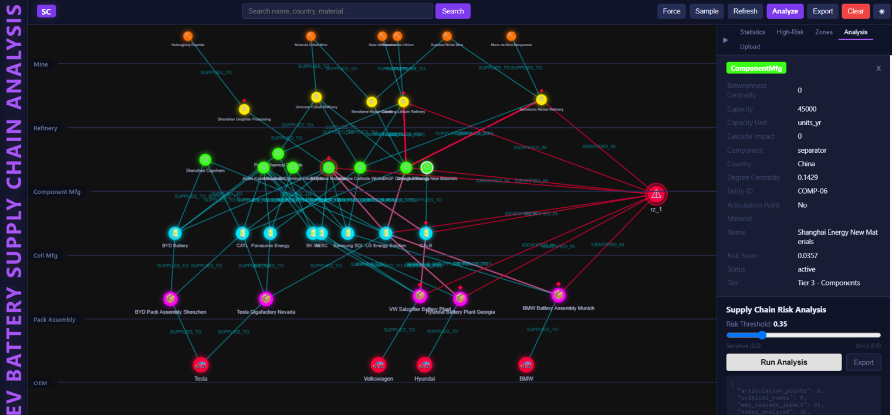
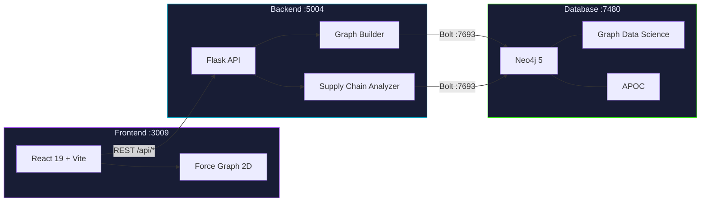
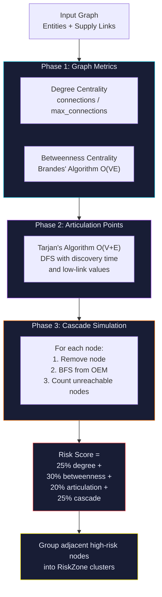
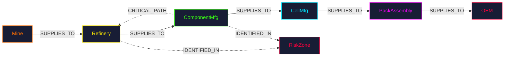
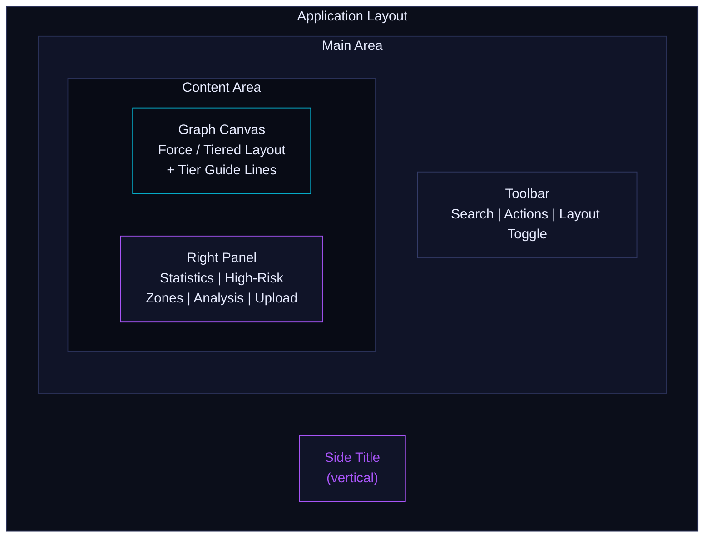

# EV Battery Supply Chain Vulnerability Analysis

A graph-based supply chain risk analysis tool that identifies critical nodes and single points of failure in the EV battery supply chain using Neo4j, Flask, and React.



## Overview

This application models the EV battery supply chain (mines, refineries, component manufacturers, cell manufacturers, pack assemblers, OEMs) as a graph in Neo4j, then runs a three-phase risk analysis to find the most critical nodes whose disruption would cause maximum supply chain impact.

## Architecture

| Service | Technology | Port |
|---------|-----------|------|
| Database | Neo4j 5 + Graph Data Science + APOC | 7480 (browser), 7693 (bolt) |
| Backend | Flask / Python | 5004 |
| Frontend | React 19 + Vite | 3009 |

All three services are orchestrated with Docker Compose.

### System Architecture



### Risk Analysis Algorithm



### Supply Chain Graph Data Model



### UI Layout



## How It Works

### Data Ingestion

Upload two CSV files through the right panel's Upload tab:
1. **Entities CSV** -- each row becomes a node (Mine, Refinery, ComponentMfg, CellMfg, PackAssembly, or OEM)
2. **Links CSV** -- each row becomes a SUPPLIES_TO relationship between two entities

Alternatively, click "Sample" in the toolbar to load the built-in dataset (36 entities, 57 links).

### Three-Phase Risk Analysis

**Phase 1 -- Graph Metrics**
Computes degree centrality and betweenness centrality (Brandes' algorithm) for every supply chain entity.

**Phase 2 -- Articulation Point Detection**
Uses Tarjan's algorithm to find nodes whose removal disconnects the supply graph.

**Phase 3 -- Cascade Disruption Simulation**
For each node, simulates its removal and runs BFS from OEM nodes to count how many nodes become unreachable.

**Risk Score** -- Weighted composite: 25% degree centrality + 30% betweenness centrality + 20% articulation point flag + 25% cascade impact. Nodes above the threshold are grouped into RiskZone clusters.

## Getting Started

### Prerequisites

- Docker and Docker Compose

### Run the Application

```bash
docker compose up --build
```

Once all services are healthy, open **http://localhost:3009** in your browser.

### Usage

1. **Load data** -- Click "Sample" in the toolbar to load the example supply chain, or use the Upload tab in the right panel
2. **Run analysis** -- Click "Analyze" in the toolbar or use the Analysis tab for threshold control
3. **Switch layout** -- Click "Tiered" to organize nodes by supply chain tier (Mine → OEM top to bottom), or "Force" for free-form
4. **Explore results** -- High-risk nodes glow red, articulation points show a red diamond marker
5. **Review details** -- Click any node to see its properties, risk score, and cascade impact in the right panel
6. **Export** -- Click "Export" for an Excel report with entity scores and zone summaries

### Graph Interactions

- **Click a node or link** to view properties in the right panel
- **Click a risk zone** in the right panel to zoom into that zone's cluster
- **Drag a node** to pin it; right-click to unpin or remove
- **Search** by name, country, material, or entity type
- **Resize the right panel** by dragging its left edge (240-500px)
- **Toggle layout** between Force (free-form) and Tiered (organized by supply chain tier)
- **Toggle dark/light theme** with the sun/moon button

### Sample Data

The included sample dataset represents an EV battery supply chain with 36 entities and 57 links:

- **Mining (Tier 1)**: 6 mines (lithium in Australia/Chile, cobalt in DRC, nickel in Indonesia, graphite in China, manganese in Brazil)
- **Refining (Tier 2)**: 5 refineries (China, Belgium, Japan, Finland)
- **Components (Tier 3)**: 8 component manufacturers (cathode, anode, electrolyte, separator)
- **Cell Manufacturing (Tier 4)**: 8 cell makers (CATL, LG, Samsung SDI, Panasonic, BYD, SK On, AESC, CALB)
- **Pack Assembly (Tier 5)**: 5 pack assemblers (US, Germany, China)
- **OEMs (Tier 6)**: 4 automakers (Tesla, BMW, Volkswagen, Hyundai)

Designed single-points-of-failure:
- **REF-02** (Umicore cobalt refinery) -- sole cobalt refiner for multiple cathode manufacturers
- **COMP-05** (Asahi Kasei) -- dominant separator supplier to 7 of 8 cell makers
- **COMP-03** (BTR New Materials) -- sole anode supplier to 6 cell makers
- Geographic concentration in China for refining and component manufacturing

### Neo4j Browser

Access the Neo4j browser directly at **http://localhost:7480** (credentials: neo4j / password).

## API Endpoints

| Method | Route | Description |
|--------|-------|-------------|
| POST | /api/ingest/preview | Parse uploaded file for column mapping |
| POST | /api/ingest/mapped | Apply mapping and ingest |
| POST | /api/ingest/sample | Load sample supply chain |
| POST | /api/ingest/clear | Clear all data |
| POST | /api/analyze/run | Run risk analysis |
| GET | /api/analyze/stats | Get analysis statistics |
| GET | /api/analyze/export | Export results as Excel |
| GET | /api/graph/full | Get complete graph |
| GET | /api/graph/zone/:id | Get risk zone cluster |
| GET | /api/graph/search?q= | Search entities |
| GET | /api/graph/zones | List risk zones |
| GET | /api/graph/critical | Get top high-risk nodes |
| GET | /api/graph/schema | Get graph schema |

## Project Structure

```
neo4tune_supply_chain_analysis/
  docker-compose.yml
  server/
    app.py                        # Flask entry point
    db_client.py                  # Neo4j driver singleton
    graph_builder.py              # Entity/link ingestion and parsing
    supply_chain_analyzer.py      # Three-phase risk analysis
    routes/
      ingest.py                   # Upload and data management endpoints
      analyze.py                  # Analysis and export endpoints
      graph.py                    # Graph query endpoints
    sample_data/
      sample_entities.csv         # 36 supply chain entities
      sample_links.csv            # 57 supply relationships
  client/
    src/
      App.jsx                     # Main app with toolbar + right panel layout
      api.js                      # Axios API client
      constants.js                # Node colors, icons, sizes
      hooks/
        useGraphData.js           # Graph state management
      components/
        Toolbar.jsx               # Top toolbar with search and actions
        RightPanel.jsx            # Collapsible tabbed right panel
        GraphCanvas.jsx           # Force/tiered graph with risk glow
        NodeDetail.jsx            # Node/link property inspector
        StatsPanel.jsx            # Supply chain statistics
        AnalysisPanel.jsx         # Analysis controls and threshold
        UploadPanel.jsx           # Entity/link file upload with mapping
        RiskNodesList.jsx         # Ranked high-risk nodes list
```
